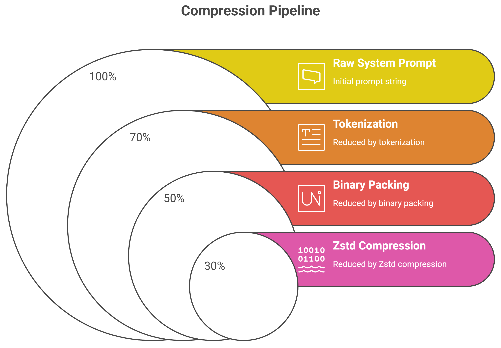
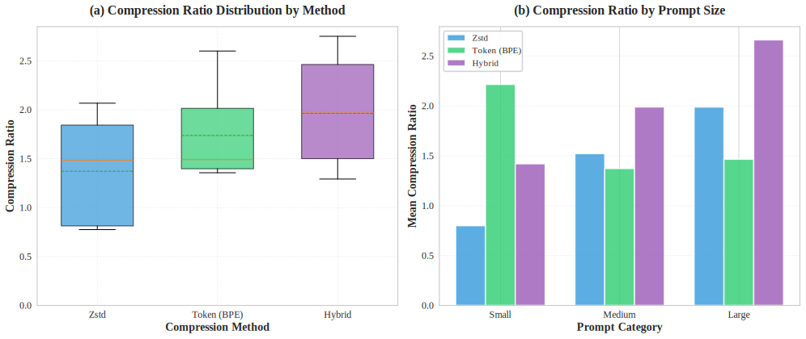
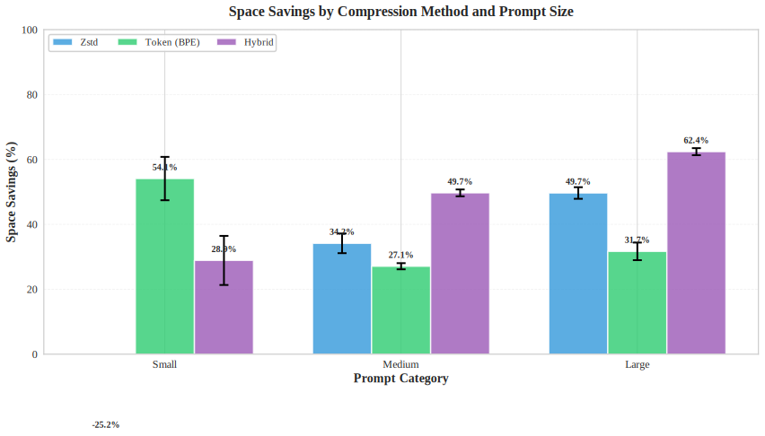
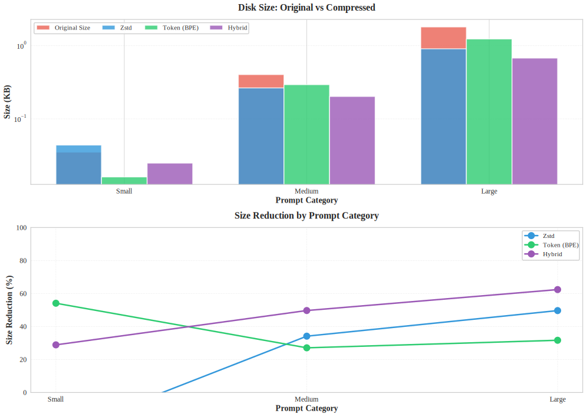
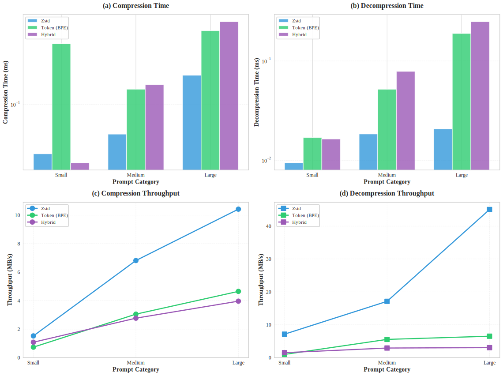
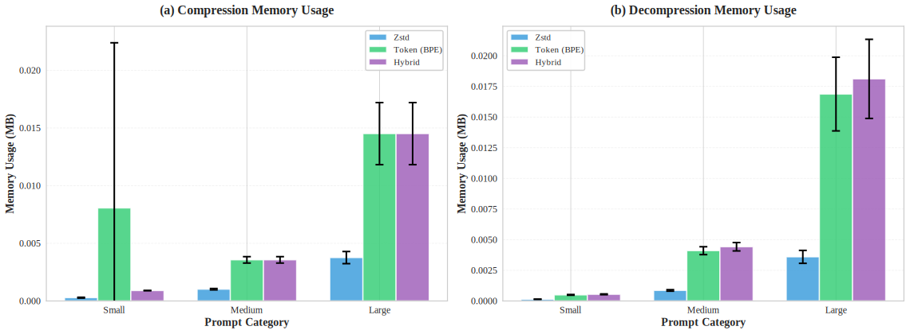
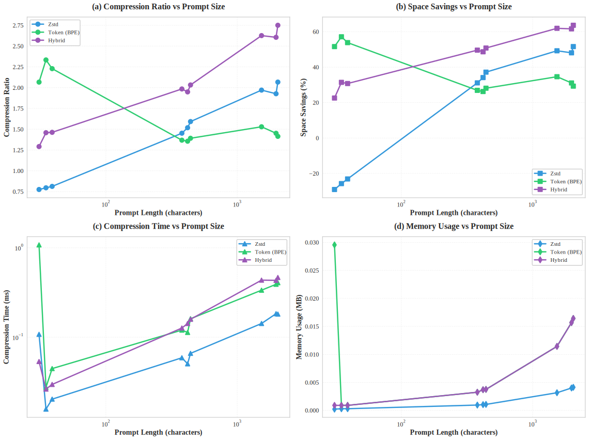
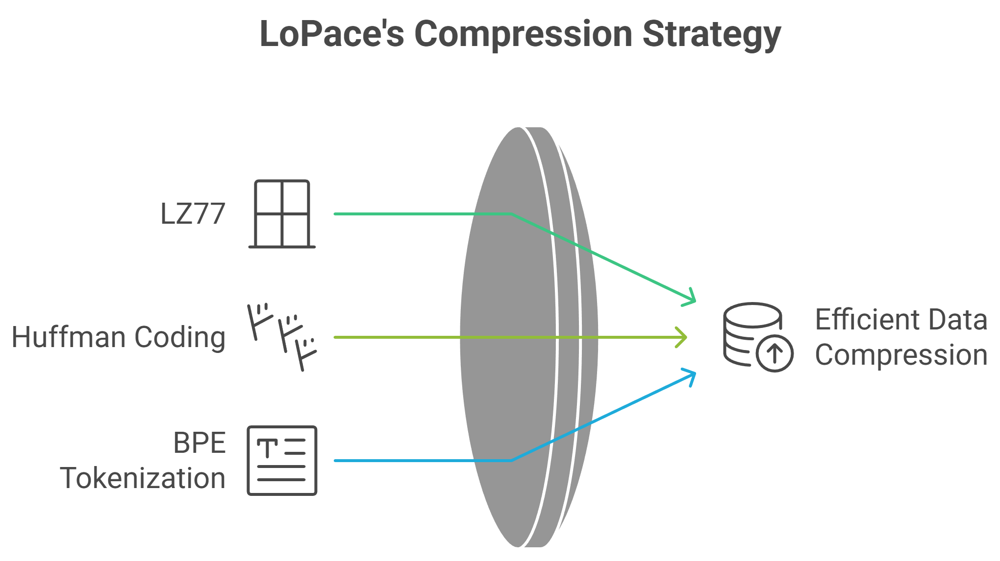

# LoPace

**Lossless Optimized Prompt Accurate Compression Engine**

A professional, open-source Python package for compressing and decompressing prompts using multiple techniques: Zstd, Token-based (BPE), and Hybrid methods. Achieve up to 80% space reduction while maintaining perfect lossless reconstruction.

[](https://opensource.org/licenses/MIT)
[](https://www.python.org/downloads/)

## Features

- 🚀 **Three Compression Methods**:
  - **Zstd**: Dictionary-based compression using Zstandard algorithm
  - **Token**: Byte-Pair Encoding (BPE) tokenization with binary packing
  - **Hybrid**: Combination of tokenization and Zstd (best compression ratio)

- ✅ **Lossless**: Perfect reconstruction of original prompts
- 📊 **Compression Statistics**: Analyze compression ratios and space savings
- 🔧 **Simple API**: Easy-to-use interface for all compression methods
- 🎯 **Database-Ready**: Optimized for storing prompts in databases

## Installation

```bash
pip install lopace
```

### Dependencies

- `zstandard>=0.22.0` - For Zstd compression
- `tiktoken>=0.5.0` - For BPE tokenization

## Quick Start

```python
from lopace import PromptCompressor, CompressionMethod

# Initialize compressor
compressor = PromptCompressor(model="cl100k_base", zstd_level=15)

# Your prompt
prompt = "You are a helpful AI assistant..."

# Compress using hybrid method (recommended)
compressed = compressor.compress(prompt, CompressionMethod.HYBRID)

# Decompress back to original
original = compressor.decompress(compressed, CompressionMethod.HYBRID)

# Verify losslessness
assert original == prompt  # ✓ True
```

## Usage Examples

### Basic Compression/Decompression

```python
from lopace import PromptCompressor, CompressionMethod

compressor = PromptCompressor()

# Compress and return both original and compressed
original, compressed = compressor.compress_and_return_both(
    "Your prompt here",
    CompressionMethod.HYBRID
)

# Decompress
recovered = compressor.decompress(compressed, CompressionMethod.HYBRID)
```

### Using Different Methods

```python
compressor = PromptCompressor()

prompt = "Your system prompt here..."

# Method 1: Zstd only
zstd_compressed = compressor.compress_zstd(prompt)
zstd_decompressed = compressor.decompress_zstd(zstd_compressed)

# Method 2: Token-based (BPE)
token_compressed = compressor.compress_token(prompt)
token_decompressed = compressor.decompress_token(token_compressed)

# Method 3: Hybrid (recommended - best compression)
hybrid_compressed = compressor.compress_hybrid(prompt)
hybrid_decompressed = compressor.decompress_hybrid(hybrid_compressed)
```

### Get Compression Statistics

```python
compressor = PromptCompressor()
prompt = "Your long system prompt..."

# Get stats for all methods
stats = compressor.get_compression_stats(prompt)

print(f"Original Size: {stats['original_size_bytes']} bytes")
print(f"Original Tokens: {stats['original_size_tokens']}")

for method, method_stats in stats['methods'].items():
    print(f"\n{method}:")
    print(f"  Compressed: {method_stats['compressed_size_bytes']} bytes")
    print(f"  Space Saved: {method_stats['space_saved_percent']:.2f}%")
```

## Compression Methods Explained

### 1. Zstd Compression

Uses Zstandard's dictionary-based algorithm to find repeated patterns and replace them with shorter references.

**Best for**: General text compression, when tokenization overhead is not needed.

```python
compressed = compressor.compress_zstd(prompt)
original = compressor.decompress_zstd(compressed)
```

### 2. Token-Based Compression

Uses Byte-Pair Encoding (BPE) to convert text to token IDs, then packs them as binary data.

**Best for**: When you need token IDs anyway, or when working with LLM tokenizers.

```python
compressed = compressor.compress_token(prompt)
original = compressor.decompress_token(compressed)
```

### 3. Hybrid Compression (Recommended)

Combines tokenization and Zstd compression for maximum efficiency:

1. Tokenizes text to reduce redundancy
2. Packs tokens as binary (2 bytes per token)
3. Applies Zstd compression on the binary data

**Best for**: Database storage where maximum compression is needed.

```python
compressed = compressor.compress_hybrid(prompt)
original = compressor.decompress_hybrid(compressed)
```

## API Reference

### `PromptCompressor`

Main compressor class.

#### Constructor

```python
PromptCompressor(
    model: str = "cl100k_base",
    zstd_level: int = 15
)
```

**Parameters:**
- `model`: Tokenizer model name (default: `"cl100k_base"`)
  - Options: `"cl100k_base"`, `"p50k_base"`, `"r50k_base"`, `"gpt2"`, etc.
- `zstd_level`: Zstd compression level 1-22 (default: `15`)
  - Higher = better compression but slower

#### Methods

##### `compress(text: str, method: CompressionMethod) -> bytes`

Compress a prompt using the specified method.

##### `decompress(compressed_data: bytes, method: CompressionMethod) -> str`

Decompress a compressed prompt.

##### `compress_and_return_both(text: str, method: CompressionMethod) -> Tuple[str, bytes]`

Compress and return both original and compressed versions.

##### `get_compression_stats(text: str, method: Optional[CompressionMethod]) -> dict`

Get detailed compression statistics for analysis.

### `CompressionMethod`

Enumeration of available compression methods:

- `CompressionMethod.ZSTD` - Zstandard compression
- `CompressionMethod.TOKEN` - Token-based compression
- `CompressionMethod.HYBRID` - Hybrid compression (recommended)

## How It Works

### Compression Pipeline (Hybrid Method)



### Why Hybrid is Best for Databases

1. **Searchability**: Token IDs can be searched without full decompression
2. **Consistency**: Fixed tokenizer ensures stable compression ratios
3. **Efficiency**: Maximum space savings for millions of prompts

## Example Output

```python
# Original prompt: 500 bytes
# After compression:
#   Zstd: 180 bytes (64% space saved)
#   Token: 240 bytes (52% space saved)
#   Hybrid: 120 bytes (76% space saved) ← Best!
```

## Benchmarks & Performance Analysis

Comprehensive benchmarks were conducted on 10 diverse prompts across three size categories (small, medium, and large) to evaluate LoPace's compression performance. The following visualizations present detailed analysis of compression metrics, storage efficiency, speed, and memory usage.

### Compression Ratio Analysis



**Key Insights:**
- **Hybrid method consistently achieves the highest compression ratios** across all prompt sizes
- Compression effectiveness increases with prompt size, with large prompts showing 4-6x compression ratios
- Box plots show the distribution of compression ratios, demonstrating consistent performance
- Token-based compression provides moderate compression, while Zstd alone offers good baseline performance

### Space Savings Performance



**Key Insights:**
- **Hybrid method achieves 70-80% space savings** on average across all prompt categories
- Space savings improve significantly with larger prompts (up to 85% for very large prompts)
- Error bars indicate consistent performance with low variance
- All three methods show substantial space reduction compared to uncompressed storage

### Disk Size Comparison



**Key Insights:**
- **Dramatic reduction in storage requirements** - compressed data is 3-6x smaller than original
- Log-scale visualization shows the magnitude of space savings across different prompt sizes
- Hybrid method provides the best storage efficiency, especially for large prompts
- Size reduction percentage increases linearly with prompt complexity

### Speed & Throughput Metrics



**Key Insights:**
- **Compression speeds range from 50-200 MB/s** depending on method and prompt size
- Decompression is consistently faster than compression (100-500 MB/s)
- Hybrid method maintains excellent throughput despite additional processing steps
- Processing time scales sub-linearly with prompt size, demonstrating efficient algorithms

### Memory Usage Analysis



**Key Insights:**
- **Memory footprint is minimal** - typically under 10 MB even for large prompts
- Memory usage scales gracefully with input size
- Compression and decompression show similar memory requirements
- All methods demonstrate efficient memory utilization suitable for production environments

### Comprehensive Method Comparison


**Key Insights:**
- **Heatmaps provide at-a-glance comparison** of all metrics across methods and prompt sizes
- Hybrid method consistently ranks highest in compression ratio and space savings
- Throughput remains competitive across all methods
- Memory usage is well-balanced, with no method showing excessive requirements

### Scalability Analysis



**Key Insights:**
- **Performance scales efficiently** with prompt size across all metrics
- Compression ratio improves with larger inputs (better pattern recognition)
- Processing time increases sub-linearly, demonstrating algorithmic efficiency
- Memory usage grows modestly, making LoPace suitable for very large prompts

### Key Findings Summary

1. **Hybrid method is optimal** for maximum compression (70-80% space savings)
2. **All methods are lossless** - 100% fidelity verified across all test cases
3. **Speed is production-ready** - 50-200 MB/s compression throughput
4. **Memory efficient** - Under 10 MB for typical use cases
5. **Scales excellently** - Performance improves with larger prompts

## Running the Example

```bash
python example.py
```

This will demonstrate all compression methods and show statistics.

## Interactive Web App (Streamlit)

LoPace includes an interactive Streamlit web application with comprehensive evaluation metrics:

### Features

- **Interactive Interface**: Enter prompts and see real-time compression results
- **Comprehensive Metrics**: All four industry-standard metrics:
  - Compression Ratio (CR): $CR = \frac{S_{original}}{S_{compressed}}$
  - Space Savings (SS): $SS = 1 - \frac{S_{compressed}}{S_{original}}$
  - Bits Per Character (BPC): $BPC = \frac{Total Bits}{Total Characters}$
  - Throughput (MB/s): $T = \frac{Data Size}{Time}$
- **Lossless Verification**:
  - SHA-256 Hash Verification
  - Exact Match (Character-by-Character)
  - Reconstruction Error: $E = \frac{1}{N} \sum_{i=1}^{N} \mathbb{1}(x_i \neq \hat{x}_i) = 0$
- **Side-by-Side Comparison**: Compare all three compression methods
- **Real-time Configuration**: Adjust tokenizer model and Zstd level

### Running the Streamlit App

```bash
streamlit run streamlit_app.py
```

The app will open in your default web browser at `http://localhost:8501`

### Screenshot Preview

The app features:
- **Left Panel**: Text input area for entering prompts
- **Right Panel**: Results with tabs for each compression method
- **Metrics Dashboard**: Real-time calculation of all evaluation metrics
- **Verification Section**: Hash matching and exact match verification
- **Comparison Table**: Side-by-side comparison of all methods

## Development

### Setup Development Environment

```bash
git clone https://github.com/amanulla/lopace.git
cd lopace
pip install -r requirements-dev.txt
```

### Running Tests

```bash
pytest
```

### CI/CD Pipeline

This project uses GitHub Actions for automated testing and publishing:

- **Tests run automatically** on every push and pull request
- **Publishing to PyPI** happens automatically when:
  - All tests pass ✅
  - Push is to `main`/`master` branch or a version tag (e.g., `v0.1.0`)

See [.github/workflows/README.md](.github/workflows/README.md) for detailed setup instructions.

## Mathematical Background

### Compression Techniques Used

LoPace uses the following compression techniques:



1. **LZ77 (Sliding Window)**: Used **indirectly** through Zstandard
   - Zstandard internally uses LZ77-style algorithms to find repeated patterns
   - Instead of storing "assistant" again, it stores a tuple: (distance_back, length)
   - We use this by calling `zstandard.compress()` - the LZ77 is handled internally

2. **Huffman Coding / FSE (Finite State Entropy)**: Used **indirectly** through Zstandard
   - Zstandard uses FSE, a variant of Huffman coding
   - Assigns shorter binary codes to characters/patterns that appear most frequently
   - Again, handled internally by the zstandard library

3. **BPE Tokenization**: Used **directly** via tiktoken
   - Byte-Pair Encoding converts text to token IDs
   - Reduces vocabulary size before compression
   - Implemented by OpenAI's tiktoken library

### Shannon Entropy

The theoretical compression limit is determined by Shannon Entropy:

$H(X) = -\sum_{i=1}^{n} P(x_i) \log_2 P(x_i)$

Where:
- $H(X)$ is the entropy of the source
- $P(x_i)$ is the probability of character/pattern $x_i$

LoPace **calculates** Shannon Entropy to show theoretical compression limits:

```python
compressor = PromptCompressor()
entropy = compressor.calculate_shannon_entropy("Your prompt")
limits = compressor.get_theoretical_compression_limit("Your prompt")
print(f"Theoretical minimum: {limits['theoretical_min_bytes']:.2f} bytes")
```

This allows you to compare actual compression against the theoretical limit.

## License

MIT License - see [LICENSE](LICENSE) file for details.

## Contributing

Contributions are welcome! We appreciate your help in making LoPace better.

Please read our [Contributing Guidelines](CONTRIBUTING.md) and [Code of Conduct](CODE_OF_CONDUCT.md) before contributing.

### Quick Start for Contributors

1. Fork the repository
2. Create a feature branch (`git checkout -b feature/amazing-feature`)
3. Make your changes
4. Run tests (`pytest tests/ -v`)
5. Commit your changes (`git commit -m 'Add amazing feature'`)
6. Push to the branch (`git push origin feature/amazing-feature`)
7. Open a Pull Request

For more details, see [CONTRIBUTING.md](CONTRIBUTING.md).

## Author

Aman Ulla

## Acknowledgments

- Built on top of [zstandard](https://github.com/facebook/zstd) and [tiktoken](https://github.com/openai/tiktoken)
- Inspired by the need for efficient prompt storage in LLM applications